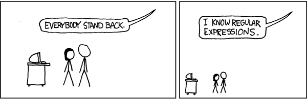

# Düzenli İfadeler 🐣



## Terminoloji - Regex Tam Olarak Nedir?

Regex yani düzenli ifadeler temelde bir katar / metin \(string\) içerisinde belirli desenleri tanımak için tasarlanmıştır. Temeli matematiksel bir yapıya dayanmaktadır "[otomata teorisi](https://www.google.com/search?q=otomata+teorisi)" fakat biz bu temele değinmeyeceğiz. Tüm programlama dillerinin zühreviyatında regex - regexp mevcut demek yersiz olmayacaktır. Yazdığımız betikleri, programları tanıyan ve bunları makine diline çeviren yapılar aynı şekilde otomata teorisini ve regex'leri kullanmaktadır.




## Regex Kullanım Alanları

Kullanım alanlarına birkaç örnek verelim,



## Regex

```javascript
^[^@\s]+@[^@\s]+\.\w{2,6}$
```

### Adım adım açıklayalım,

* `^` -&gt; Girdi başlangıcı.
* `[^@\s]` -&gt; Boşluk `\s` ve `@` karakteri dışındakileri eşleştir.
* `+` -&gt; 1+ kere.
* `@` -&gt; `@` karakterini eşleştir.
* `[^@\s]+` -&gt;  Boşluk `\s` ve `@` karakteri dışındakileri eşleştir. 1+ kere.
* `\.` -&gt; `.` karakterini eşleştir.
* `\w{2,6}` -&gt; 2-6 karakter arasında tüm karakterleri eşleştir \(sayı, alt çizgi veya harf\).
* `$` -&gt; Girdi sonu

### Gerçek hayatta karşılaşabileceğiniz senaryolar;

```javascript
const isValidEmail = input => {
  /*
    Aşağıdaki regex'i yayında kullanmayınız!
    %100 eşleşme sağlamaz. 
    Demo amaçlıdır.
  */
  const regex = /^[^@\s]+@[^@\s]+\.\w{2,6}$/g;
  const result = regex.exec(input)

  //S onuç null ise eşleşme bulunamadı
  return !!result
}

const tests = [
  `cagatay.cali@gmail.com`, // Geçerli
  '', // Geçersiz
  `test.test`, // Geçersiz
  '@cagatay@cali.com', // Geçersiz
  'cagatay@@cali.com', // Geçersiz
  `cagatay.me`, // Geçersiz
  `acilin ben regex biliyorum@test.com`, // Geçersiz
  `cok.bozdu@lost.cok.bozdu@gmail.com` // Geçersiz
]

console.log(tests.map(isValidEmail))
```



_Dilerseniz %99 oranında e-mail eşleşmesini sağlayabileceğiniz onaylı regex'i tercih edebilirsiniz;_

```javascript
(?:[a-z0-9!#$%&'*+/=?^_`{|}~-]+(?:\.[a-z0-9!#$%&'*+/=?^_`{|}~-]+)*|"(?:[\x01-\x08\x0b\x0c\x0e-\x1f\x21\x23-\x5b\x5d-\x7f]|\\[\x01-\x09\x0b\x0c\x0e-\x7f])*")@(?:(?:[a-z0-9](?:[a-z0-9-]*[a-z0-9])?\.)+[a-z0-9](?:[a-z0-9-]*[a-z0-9])?|\[(?:(?:25[0-5]|2[0-4][0-9]|[01]?[0-9][0-9]?)\.){3}(?:25[0-5]|2[0-4][0-9]|[01]?[0-9][0-9]?|[a-z0-9-]*[a-z0-9]:(?:[\x01-\x08\x0b\x0c\x0e-\x1f\x21-\x5a\x53-\x7f]|\\[\x01-\x09\x0b\x0c\x0e-\x7f])+)\])
```

\_\_[_Spesifikasyon_](https://www.ietf.org/rfc/rfc5322.txt)\_\_


Regex sonucunda TLD \(top level domain\) kontolü - uzantı kontrolü yapmanızı şiddetle tavsiye ederim. `abc` uzantılı bir alan adı olmadığı sürece geçersiz bir e-posta olduğunu varsaymalı ve sisteme e-posta onayı ile kişileri almalıyız.




## Regex

```javascript
((?=.*\d)(?=.*[a-z])(?=.*[A-Z])(?=.*[@#$%]).{6,35})
```

### Adım adım açıklayalım,

```javascript
(			# Grup başlangıcı
  (?=.*\d)		#   0-9 arasında bir sayı içermeli
  (?=.*[a-z])		#  bir küçük karakter içermeli
  (?=.*[A-Z])		#   bir büyük karakter içermeli
  (?=.*[@#$%])		#   listedeki bir özel karakteri içermeli "@#$%"
              .		#     yukarıdaki tüm kontrollerden geçtikten sonra
                {6,20}	#        minimum 6 maksimum 20 karakter uzunluğunda	
)			# "Bir metin olmalı" desenini bitir

```


?= Tek başına anlam ifade etmez **diğer tüm durumları içerdiğinde** `true` döndürür.




## Regex

```javascript
/\b([01]?[0-9]|2[0-3]):([0-5]\d)/
```





## Ne Zaman Regex Kullanmamalısın


