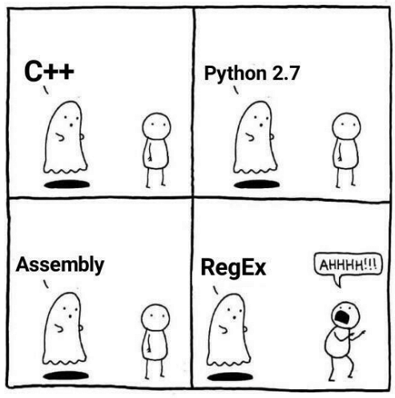

# Düzenli İfadeler 🐥


## Terminoloji - Regex Tam Olarak Nedir?

Regex yani düzenli ifadeler temelde bir katar / metin \(string\) içerisinde belirli desenleri tanımak için tasarlanmıştır. Temeli matematiksel bir yapıya dayanmaktadır "[otomata teorisi](https://www.google.com/search?q=otomata+teorisi)" fakat biz bu temele değinmeyeceğiz. Tüm programlama dillerinin zühreviyatında regex - regexp mevcut demek yersiz olmayacaktır. Yazdığımız betikleri, programları tanıyan ve bunları makine diline çeviren yapılar aynı şekilde otomata teorisini ve regex'leri kullanmaktadır.





## Regex Kullanım Alanları

Kullanım alanlarına birkaç örnek verelim,



## Regex

```javascript
^[^@\s]+@[^@\s]+\.\w{2,6}$
```

### Adım adım açıklayalım,

* `^` -&gt; Girdi başlangıcı.
* `[^@\s]` -&gt; Boşluk `\s` ve `@` karakteri dışındakileri eşleştir.
* `+` -&gt; 1+ kere.
* `@` -&gt; `@` karakterini eşleştir.
* `[^@\s]+` -&gt;  Boşluk `\s` ve `@` karakteri dışındakileri eşleştir. 1+ kere.
* `\.` -&gt; `.` karakterini eşleştir.
* `\w{2,6}` -&gt; 2-6 karakter arasında tüm karakterleri eşleştir \(sayı, alt çizgi veya harf\).
* `$` -&gt; Girdi sonu

### Gerçek hayatta karşılaşabileceğiniz senaryolar;

```javascript
const isValidEmail = input => {
  /*
    Aşağıdaki regex'i yayında kullanmayınız!
    %100 eşleşme sağlamaz. 
    Demo amaçlıdır.
  */
  const regex = /^[^@\s]+@[^@\s]+\.\w{2,6}$/g;
  const result = regex.exec(input)

  //S onuç null ise eşleşme bulunamadı
  return !!result
}

const tests = [
  `cagatay.cali@gmail.com`, // Geçerli
  '', // Geçersiz
  `test.test`, // Geçersiz
  '@cagatay@cali.com', // Geçersiz
  'cagatay@@cali.com', // Geçersiz
  `cagatay.me`, // Geçersiz
  `acilin ben regex biliyorum@test.com`, // Geçersiz
  `cok.bozdu@lost.cok.bozdu@gmail.com` // Geçersiz
]

console.log(tests.map(isValidEmail))
```



_Dilerseniz %99 oranında e-mail eşleşmesini sağlayabileceğiniz onaylı regex'i tercih edebilirsiniz;_

```javascript
(?:[a-z0-9!#$%&'*+/=?^_`{|}~-]+(?:\.[a-z0-9!#$%&'*+/=?^_`{|}~-]+)*|"(?:[\x01-\x08\x0b\x0c\x0e-\x1f\x21\x23-\x5b\x5d-\x7f]|\\[\x01-\x09\x0b\x0c\x0e-\x7f])*")@(?:(?:[a-z0-9](?:[a-z0-9-]*[a-z0-9])?\.)+[a-z0-9](?:[a-z0-9-]*[a-z0-9])?|\[(?:(?:25[0-5]|2[0-4][0-9]|[01]?[0-9][0-9]?)\.){3}(?:25[0-5]|2[0-4][0-9]|[01]?[0-9][0-9]?|[a-z0-9-]*[a-z0-9]:(?:[\x01-\x08\x0b\x0c\x0e-\x1f\x21-\x5a\x53-\x7f]|\\[\x01-\x09\x0b\x0c\x0e-\x7f])+)\])
```

\_\_[_Spesifikasyon_](https://www.ietf.org/rfc/rfc5322.txt)\_\_


Regex sonucunda TLD \(top level domain\) kontolü - uzantı kontrolü yapmanızı şiddetle tavsiye ederim. `abc` uzantılı bir alan adı olmadığı sürece geçersiz bir e-posta olduğunu varsaymalı ve sisteme e-posta onayı ile kişileri almalıyız.




## Regex

```javascript
((?=.*\d)(?=.*[a-z])(?=.*[A-Z])(?=.*[@#$%]).{6,35})
```

### Adım adım açıklayalım,

```javascript
(			# Grup başlangıcı
  (?=.*\d)		#   0-9 arasında bir sayı içermeli
  (?=.*[a-z])		#  bir küçük karakter içermeli
  (?=.*[A-Z])		#   bir büyük karakter içermeli
  (?=.*[@#$%])		#   listedeki bir özel karakteri içermeli "@#$%"
              .		#     yukarıdaki tüm kontrollerden geçtikten sonra
                {6,20}	#        minimum 6 maksimum 20 karakter uzunluğunda	
)			# "Bir metin olmalı" desenini bitir

```


?= Tek başına anlam ifade etmez **diğer tüm durumları içerdiğinde** `true` döndürür.




## Regex

```javascript
/\b([01]?[0-9]|2[0-3]):([0-5]\d)/
```






\*\*\*\*[**Detaylı regex kaynağı**](https://github.com/ziishaned/learn-regex/blob/master/translations/README-tr.md) **\(Türkçe\)**


## Ne Zaman Regex Kullanmamalısın

### Yazılım dili tespiti

Kendi hazırladığın yazılım dilini tespit etmek için regex yazmaya hazırlanıyorsan derin bir nefes al, bu senin için acı verici olabilir.

### Güvenlikle İlgili Kritik Giriş Filtreleme ve Kara Listeler

Hazırladığın platforma kullanıcının gireceği verilerin kontrolünü regex ile kontrol ediyorsan, olası tüm senaryoları öngördüğüne emin olmalısın. Bu durumlarda regex her zaman en pratik çözüm olmayabilir.

### **Performans Öncelikli Bölümler**

Regex eşleştirme hızı senin hazırladığın desene göre sistemi performans darboğazına sokabilir. Bu, çoğu durumda, özellikle girdi kısa ve kesin ise \(e-posta kontrolü\) kullanışlı olabilir. Bununla birlikte hazırladığın regex ifadesi zayıf ise sistemine ek yük bindirebileceğini göz önünde bulundurmalısın.

### Regex Gerektirmeyen Problemler

Regex katarları işlemek için çok verimli bir araç olsa dahi her zaman kullanmanı gerektirmez. Okunabilir, tekrar yazılabilir, modülarize bir şekilde regex ifadelerini yazmak meşakkatli olacak ise lütfen daha az zahmet gerektiren şekilde problemini çöz, bu seni daha az zeki yapmayacaktır.

