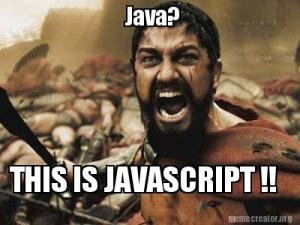

# Veri Tipleri 🥚

Her programlama dilinde olduğu gibi JavaScript dilinde de yerleşik veri tipleri vardır, ancak bunlar bir dilden diğerine göre farklılık gösterebilir. 



JavaScript dilinde  Primitive \( ilkel \) ve Object - Referance \( Nesne - Referans \) 2 ana veri türüdür.

### Primitive \( İlkel \) Veri Tipleri 

JavaScript' te, ilkel veri türü nesne değildir ve kendine ait hiçbir method' u yoktur.  

#### Numbers \( Sayılar \)

```text
let n = 175
n = 17.535
```

Sayı tipi integer ve float point sayılarını temsil eder.



```text
var a = 17;
var b = 5;

var total = a * b;

console.log(total);
console.log(typeof total);
```



```text
var a = 255;
var b = 14;

var total = a / b;

console.log(total);
console.log(typeof total);
```



```text
var a = -28;
var b = 84;

var total = a + b;

console.log(total);
console.log(typeof total);
```



```text
var a = 175;
var b = 53;

var total = a - b;

console.log(total);
console.log(typeof total);
```



Değişkenlere tanımlanan sayısal verileri doğrudan kullanarak matematiksel işlemleri `*`  , `/`  , `+`  , `-`  yapabiliriz.





JavaScript değişkenleri birçok veri türünü tutabilir:

* Number \( Sayı \)
* String \( Katar - Karakter Dizesi \)
* Undefined \( Tanımsız \)
* Null \( Değer Yok \)
* Boolean \( Mantıksal Veri Tipleri \)
* Symbol \( ECMAScript 6 \) ve daha fazlası...


